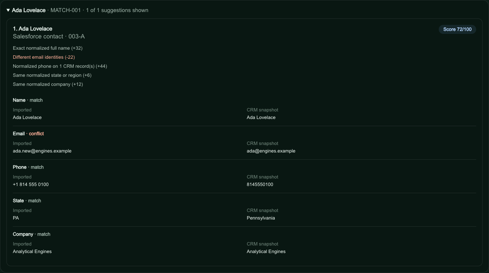

# Review possible CRM matches for an imported file

In self-hosted `/app/lab`, **Find possible CRM matches** compares active imported
rows with a saved CRM snapshot. Select **Name**, **Email**, **Phone**, **State**,
and **Company** under **Matching fields**. Suggested selections reflect usable,
populated values in the import; they are not an assessment of data accuracy.
This feature is unavailable on the static public demo.

## Read the result

Each row shows up to three ranked suggestions with CRM native IDs, compared
values, supporting evidence, conflicts, and missing values. **Score N/100** is
a deterministic ranking signal, not the probability that two records represent
one person. Probability claims need validation against known outcomes and
calibration; see [scikit-learn's calibration explanation](https://scikit-learn.org/1.7/modules/calibration.html).
This matcher has no such probability claim.

Names alone remain weak evidence. State and company supply context but cannot
identify a person alone. HubSpot primary and additional emails can supply exact
evidence; shared phone numbers receive less weight. Unselected fields do not
contribute. Suggestions never link, merge, update, or change write eligibility.
Use the separate [exact-email write preview](import-crm-comparison.md) for any
governed sync.

## Try a fictional review

Use a development or simulated snapshot containing these fictional people;
this guide does not create CRM records:

| Name | Email | Phone | State | Company |
| --- | --- | --- | --- | --- |
| Ada Lovelace | ada@engines.example | 8145550100 | Pennsylvania | Analytical Engines |
| Grace Hopper | grace@navy.example | 2125550101 | New York | Navy Example |

Save this as `possible-matches.csv`:

```csv
contact_id,full_name,email,phone,state,company
MATCH-001,Ada Lovelace,ada.new@engines.example,+1 814 555 0100,PA,Analytical Engines
MATCH-002,Grace Hopper,,,NY,
MATCH-003,Quinn Example,quinn@unrelated.example,2025550199,WA,Separate Example
```

1. Configure a direct [HubSpot](hubspot-csv-setup.md) or
   [Salesforce](salesforce-csv-setup.md) read connection. Import the CSV into a
   saved `/app/lab` workspace and select that CRM destination.
2. Open **Find possible CRM matches**. Check the five matching fields.
   **State / province** CSV mapping is separate from sales **Region**.
3. Choose **Read CRM snapshot**, or **Read fresh snapshot** to replace older
   data. **Stop after current page** pauses reading; **Resume scan** continues.
   Wait for finalization before choosing **Find suggestions for these rows**.
4. Inspect Ada's name/phone corroboration and email conflict, Grace's weaker
   name/state evidence, and Quinn's lack of suggestions in this two-person
   fixture. These are synthetic review cases, not live-provider qualification.
5. Choose **Download this review (JSON)** to retain the current page's evidence.



This screenshot uses fictional records in a disposable local database, through
the actual import, snapshot API, matcher, and review screen. With all five fields
selected, Ada scores 72/100 and Grace 38/100. No live CRM was queried or changed.

## Native read check — September 27, 2026

At 19:26 UTC, a separate read-only check used the actual CSV parser, route
handlers, SQLite scan storage, and comparison endpoint against the configured
accounts: 17 HubSpot Contacts in one page and 130 Salesforce unconverted Leads
and Contacts in two object pages. Both snapshots reached provider completion.
Existing labeled fixtures produced exact matches at 100/100, changed-email
matches with corroborating name/phone/company at 47/100, and same-name coworker
suggestions at 32/100. Unrelated imports produced no suggestions. Salesforce's
secondary mobile phone contributed matching evidence; a HubSpot phone shared by
four records produced a warning and no suggestion when used alone. No CRM writes
were made.

A later browser run at 20:09 UTC verified native scans, displayed/exported
suggestions, exact-email previews and one populated Salesforce state-name/code
match after repairing shared operator-key state and a local-runtime fetch
incompatibility. Native continuation cursors and populated HubSpot state/additional
emails remain outside these checks. The scores remain uncalibrated. See the [dated native-check evidence and limits](import-matching-native-check.md);
the illustrated walkthrough above remains a separate local fixture exercise.

## Coverage and limits

Read the snapshot's dates, record count, and complete/partial status. Provider
pagination reuses the [account scanner](duplicate-audit.md), while import
ranking uses independent rules. Scans cover HubSpot Contacts or unconverted
Salesforce Leads and Contacts. Visibility is limited by connector permissions;
caps are 25,000 records on SQLite and 10,000 on D1, possibly configured lower.
Finalized partial snapshots remain reviewable. Old snapshots may lack state or
additional emails; refresh for new fields.

Imports are reviewed in pages of 100 (**Previous 100** / **Next 100**), with at
most three suggestions per row. Candidate-search warnings identify skipped
broad groups or comparison limits. No suggestion does **not** prove CRM absence
or permission to create a record.

Inspect [matching rules](../lib/import-match.ts),
[synthetic matcher tests](../tests/import-match.test.ts), and
[snapshot-route tests](../tests/import-matches-route.test.ts).
