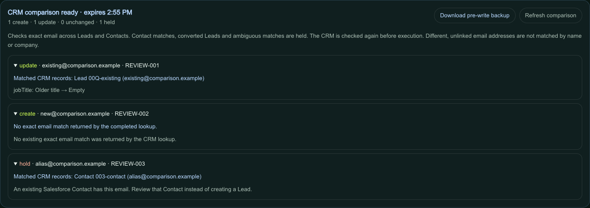

# Compare an imported file with your CRM

**Later native evidence:** the [enterprise import case](enterprise-import-native-check.md)
verified creates, updates, unchanged records, an existing Salesforce Contact hold,
repeat imports, and update rollback in development accounts on September 27, 2026.
Approximate suggestions still require manual review. Earlier read-only results below
retain their original scope.

In the self-hosted `/app/lab`, **Compare N with CRM** reads current records for
the eligible imported rows before proposing writes. It requires a direct
HubSpot or Salesforce connection. The public static demo performs no CRM reads
or writes. This is an imported-file comparison, not a native merge tool or a
whole-account duplicate scan.

For name, phone, state, company, or approximate email evidence, use the separate
[possible-match review](approximate-import-matches.md). It ranks candidates from
a dated snapshot and exports review JSON; it never selects a write target or
changes eligibility. This page describes the fresh exact-email write preview.

## Decisions you can inspect

| Current CRM result for an imported email | HubSpot | Salesforce |
| --- | --- | --- |
| No match after complete successful reads | Propose Contact create | Propose Lead create |
| One exact Contact primary or additional email match | Compare portable fields using its native ID; preserve primary email | Hold a Contact match |
| One unconverted Lead, with no other match | Not applicable | Compare portable fields using its native ID |
| Converted Lead | Not applicable | Hold |
| Multiple matching records | Hold | Hold |
| Multiple imported rows target one native record | Hold affected rows | Hold affected rows |
| Matched fields already agree | Unchanged; no write | Unchanged; no write |
| Failed, malformed, or incomplete lookup | Stop comparison | Stop comparison |

Across batches in the current workspace session, the destination summary retains
each row's latest result: created, updated, unchanged, held or failed. Completed
rows stay out of subsequent batches; held and failed rows remain pending. A new
import, local correction, repair, undo or reset clears this progress so the changed
input is compared again. Reload also requires a fresh comparison; saved run
receipts remain available under `/runs`.

Local eligibility checks still apply. The comparison shows matched native IDs,
field differences, and reasons for holds. It does not use fuzzy names or company
similarity to join different, unlinked emails. HubSpot's
[additional email identifiers](https://developers.hubspot.com/docs/api-reference/legacy/crm/objects/contacts/guide#additional-emails)
can link an imported secondary email to an existing Contact; the update uses
that Contact's ID and does not replace its primary email.

## Try with your own development CRM

1. Start the [self-hosted workspace](../README.md#quick-start-one-command-no-accounts-required),
   then configure a direct [HubSpot](hubspot-csv-setup.md#option-a-account-service-key)
   or [Salesforce](salesforce-csv-setup.md#local-connection) connection. Use a
   development account and clearly labeled synthetic records.
2. Save the following as `crm-comparison.csv` and import it in `/app/lab`:

   ```csv
   contact_id,full_name,email,company,region,segment,lifecycle_stage,expected_lifecycle_stage,owner_id
   REVIEW-001,Alex Example,existing@comparison.example,Comparison Example,Northeast,Enterprise,lead,lead,NE-ENT
   REVIEW-002,Blair Example,new@comparison.example,Comparison Example,Northeast,Enterprise,lead,lead,NE-ENT
   REVIEW-003,Casey Example,alias@comparison.example,Comparison Example,Northeast,Enterprise,lead,lead,NE-ENT
   ```

3. To exercise matches, first add synthetic CRM records with selected emails
   from the file. For HubSpot, make `alias@comparison.example` an additional
   email on the same Contact as `existing@comparison.example`: both imported
   rows should be held because they target one Contact. For Salesforce, use
   an unconverted Lead for one email and a Contact for another. Leave the new
   email absent. Results depend on the CRM records you actually create.
4. Select HubSpot or Salesforce under **Where should clean records go?**, then
   choose **Compare N with CRM** and inspect the proposed creates, updates,
   unchanged rows, and holds. Comparison itself does not write to the CRM.
   Execute only after reviewing the changes. `/runs` records outcomes and
   eligible update rollback; newly created records are not auto-deleted.

## Execution boundaries

While a CRM comparison or sync is running, workspace controls pause until its
result and receipt saving finish. This keeps imports, reset, undo, CRM switching
and comparison refresh from replacing the input of a pending request. Controls
also wait for an existing workspace save or repair; errors release them for retry.

Plans expire after 15 minutes. Execution rereads the relevant CRM records and
rejects a changed comparison; invalid or incomplete reads cannot prove absence.
Persisted whole-account scans are not used as absence evidence. Read visibility
is limited to the configured credentials.

Direct HubSpot creates use the native create operation, including the legacy
direct sync route. A create conflict fails instead of falling back to an update.
Salesforce writes set `allowSave=false` in the
[duplicate-rule header](https://developer.salesforce.com/docs/platform/api-rest/guide/headers-duplicaterules.html),
so configured duplicate rules are not bypassed. A reread and write are separate
operations: neither connector guarantees atomic protection against external
writers.

The existing HubSpot n8n workflow remains a delegated email upsert, without this
comparison promise. The disabled Salesforce n8n node is unchanged. No path here
merges native CRM records or converts Leads.

## Verification



This local browser capture uses the three-row CSV above and simulated CRM
responses. The CSV import and local persistence ran in the app; the displayed
CRM IDs are fictional. Desktop and 390px browser checks covered matched IDs,
hold reasons, backup download, stale-execution errors and HubSpot alias holds.

The comparison and reader tests use mocked provider responses and synthetic
records, including aliases, cross-object matches, partial reads, stale plans,
and create conflicts:

```bash
npm test -- tests/crm-import-comparison.test.ts tests/crm-existing-hubspot.test.ts tests/crm-existing-salesforce.test.ts
```

A separate [September 27 native read check](import-matching-native-check.md)
verified exact-email preview proposals against existing fictional HubSpot and
Salesforce records: unchanged/update/create proposals, and a held Salesforce
Contact. A later browser follow-up verified rendered native previews after fixing
shared operator-key state and a local worker fetch incompatibility. No proposed
change was executed. Live write execution, duplicate-rule
behavior, converted Leads and additional-email cases remain unqualified by that
run. Historical Salesforce receipts elsewhere describe a separate workflow;
neither those receipts nor these development reads establish behavior under
your account's permissions or duplicate rules.

## Repeat the batch-progress browser check

With a disposable local app running and an installed Chrome/Chromium browser:

```bash
CONTROL_TOWER_BROWSER_BASE_URL=http://127.0.0.1:3000 \
CHROMIUM_PATH="/Applications/Google Chrome.app/Contents/MacOS/Google Chrome" \
npm run test:crm-batches
```

This regression imports 105 fictional contacts and supplies simulated CRM
receipts for both providers. It checks that completed rows stay completed across
batches, a successful retry replaces a failure, unchanged rows are not reported
as updates, held rows remain pending, and a replacement import clears progress.
It also pauses comparison, execution and run-history saving to verify that
workspace controls stay disabled, then checks recovery from a failed comparison.
Only local workspace and run-history storage reach the app; private CRM responses
are intercepted and external requests are blocked. This is browser regression
evidence, not native CRM write qualification.
