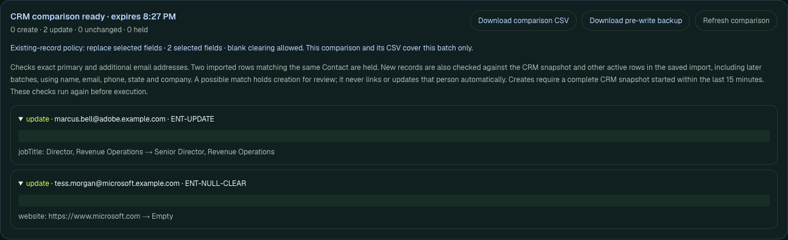

# Native operator controls check — September 28, 2026 UTC

The saved row decisions, update policies and CSV reports were checked through the
browser against both development CRMs, with **no mocked provider responses**.
HubSpot ran at **00:12:05–00:12:14 UTC** and Salesforce at
**00:12:18–00:12:33 UTC** (September 27 in US Eastern time). The tested application
was commit `a666b6c`.

HubSpot was the designated `STANDARD` development portal. Salesforce was
`Developer Edition`, with `IsSandbox=false`. These were development accounts,
not production customer systems or formally provisioned sandboxes. The script
verified each account against the private fixture manifest before proceeding.

## What the operator did

The check reused the nine retained [fictional enterprise records](enterprise-import-fixtures.md).
It imported Marcus, Tess and Elena at their existing email addresses. Marcus's
import proposed a new title and phone; Tess's website was blank; Elena's import
proposed a different title. All people and contact details are fictional.

1. Compare using the default **Fill empty fields only** policy. All three records
   were unchanged: populated CRM values were protected.
2. Skip Elena with a reason, reload, restore her, then skip her again. Each saved
   decision invalidated the comparison. The next comparison contained only
   Marcus and Tess.
3. Select **Replace selected fields**, allow only **job title** and **website**,
   and explicitly allow blank clearing. The preview contained exactly Marcus's
   title replacement and Tess's website clear. Marcus's proposed phone change
   was excluded because phone was not selected. Execute and read back the CRM.
4. Import Tess with her original website and a deliberately conflicting title.
   Select **Fill empty fields only**. Only her empty website was filled; her
   populated title remained unchanged.
5. Roll back the original two-update run. Marcus's title was restored; Tess was
   reported unchanged because her website had already been restored.

## Observed results

| Check | HubSpot | Salesforce |
| --- | --- | --- |
| Default comparison | 3 unchanged, 0 updates | 3 unchanged, 0 updates |
| Saved skip/restore after reload | Passed | Passed |
| Selected replacement and clear | 2 updated | 2 updated |
| Fill empty website; preserve populated title | 1 updated | 1 updated |
| Original rollback | 1 restored, 1 already restored | 1 restored, 1 already restored |
| Creates / deletes / failed rows | 0 / 0 / 0 | 0 / 0 / 0 |
| Final compared fields match starting values | All 9 records | All 9 records |

Independent provider reads checked identity, the six portable fields, state,
city, fixture marker and owner. Skipped Elena and the other control records
remained unchanged. Equality refers to these compared fields, not audit
timestamps or every CRM property.

These are native-backed previews from the successful runs. Native identifiers
are masked; the comparison scroll area was expanded for readability.

## Inspect the spreadsheet reports

Comparison CSVs contained the proposed changes and blank outcome cells. After
execution, results CSVs were downloaded from reloaded run history and checked
against the saved receipts by contact ID, native ID and outcome. Both the fill
and rollback results were checked too. Receipt saves returned HTTP `201`.

Download the actual selected-update reports with **native, plan and run identifiers
redacted**: [HubSpot results](../public/import-controls-hubspot-results.csv) and
[Salesforce results](../public/import-controls-salesforce-results.csv). Field changes,
policies, fictional identities and observed outcomes are retained.

The [machine-readable evidence](evidence/import-operator-controls-native-2026-09-28.json)
records dates, counts and scope. Use the [repeat instructions](enterprise-import-fixtures.md#repeat-the-operator-controls-check)
for your own designated development accounts. The script stops on unexpected
state; it does not reset records to manufacture a passing run.

This is a three-row existing-record workflow check, not a duplicate-detection
benchmark. It adds native evidence for these controls while the earlier local
tests retain their separate coverage of failed saves, stale previews and mobile
layout. Snapshot limitations and concurrent external writers remain boundaries.
