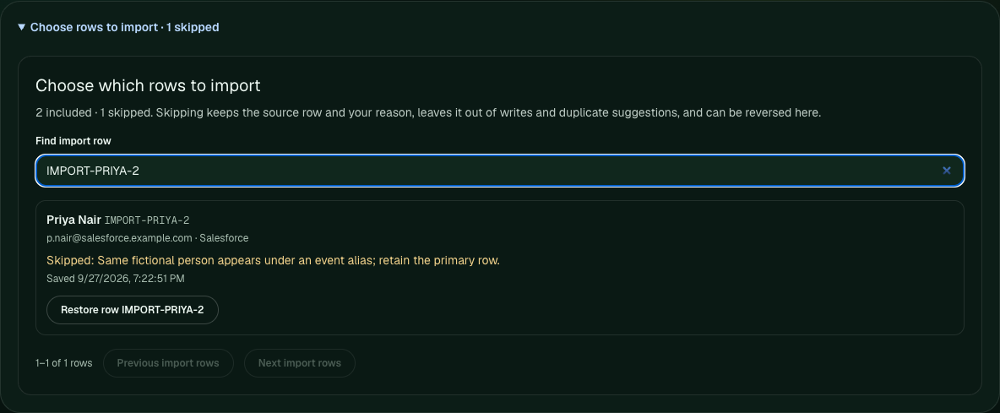
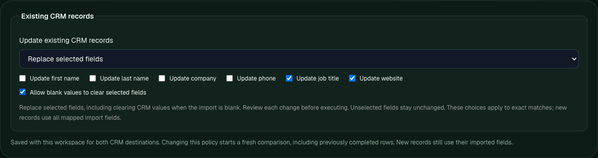

# Control the import before writing

The self-hosted `/app/lab` now lets an operator choose rows, protect existing
CRM fields, and take a batch-level decision report into a spreadsheet. These
controls are available with the governed direct HubSpot and Salesforce connectors.
The public site remains a static demonstration with no connected CRM.

## Choose which rows to import

Open **Choose rows to import**, search by row ID, name, email or company, enter
a reason and choose **Skip row**. The source row stays visible; **Restore row**
includes it again. Decisions persist with the workspace and survive reload.
A failed save leaves the previous selection and comparison in place.

Skipped rows stay out of destination batches, local repairs and duplicate
suggestions. For two possible duplicates within the import, explicitly skipping
one lets the other be reviewed on its own. It does not bypass a possible match
already in the CRM. Exact-email duplicate flags are recomputed for the included
rows. Restoring a row brings back any resulting duplicate hold.

**Export repaired CSV** retains all rows and includes `import_skip_reason` and
`import_skipped_at`, so reimporting that file preserves the selection. Workspace
undo can restore an earlier decision; resetting the import restores its original
selection. Skipping does not delete, merge or modify a CRM record. It preserves
completed rows in the current session rather than requeueing successful writes.

The server loads the saved workspace for every governed preview and execution,
including updates. A row skipped or changed after preview cannot execute under
that old preview. Legacy direct-sync/webhook endpoints do not have this saved
workspace contract; use the governed comparison for server-enforced decisions.



Local browser capture using fictional rows, simulated CRM responses and real local
workspace storage. No native CRM write is shown.

## Protect existing CRM fields

**Update existing CRM records** defaults to **Fill empty fields only**. Select
which of first name, last name, company, phone, job title and website may change.
Populated CRM fields and fields not selected stay unchanged.

Choose **Replace selected fields** when replacement is intentional. Blank import
values still preserve the current CRM value unless you separately enable
**Allow blank values to clear selected fields**. A missing column and a blank
cell are both blank at this stage: this permission applies to all selected
fields, so inspect the preview. Provider-required fields must remain valid.

For example, an import with a new job title and an empty website can replace
only the title. The website stays intact unless it is selected and blank clearing
is enabled. Creates continue to use all mapped import fields; this policy controls
updates to exact matches, not identity linking.

The policy is saved with the workspace for both providers. Changing it clears
previews and starts a new comparison, including previously completed rows. The
preview shows only permitted changes. Execution checks the saved policy again,
sends only changed fields to the provider, and stores only those changes in the
update rollback plan.



The same local browser check shows the intentional replacement settings. The
default remains fill empty fields only.

## Download comparison and results CSVs

**Download comparison CSV** exports the current preview batch, including held
and unchanged rows, proposed changes, matching evidence and the chosen policy.
Its outcome column is empty: a proposed create is not a completed create.

After execution, open `/runs` and choose **Download results CSV** on the saved
run. This remains available after reload. Results include actual created,
updated, unchanged, held, failed and rollback outcomes as supplied by the
receipt. Rows are joined by contact ID, not response order. If a provided receipt
omits a planned row, the report says `no_receipt` rather than guessing success.
Older plan-only or receipt-only runs export the data they actually contain.

Reports distinguish native CRM IDs from import row IDs, include candidate totals
as well as the candidates shown, and label scores as evidence rankings rather
than probabilities. They cover one batch, not the entire import or CRM account.
CSV cells are quoted and formula-like text is neutralized for spreadsheet review;
source values are unchanged. These reports are for review, not reimport. Use the
repaired source CSV to move the original rows and saved skip decisions.

## Repeat the checks

```bash
npm test -- tests/import-exclusions.test.ts tests/workspace-persistence.test.ts tests/crm-workflow.test.ts tests/crm-import-comparison.test.ts tests/crm-review-export.test.ts
CONTROL_TOWER_BROWSER_BASE_URL=http://127.0.0.1:3000 npm run test:import-controls
```

The browser script requires a disposable local app and Chrome/Chromium. It uses
real local workspace/run storage and simulated provider responses for both
connectors. It verifies failed-save behavior, skip/restore across reload,
policy persistence and invalidation, pending-operation controls, downloaded
comparisons and saved results, and a 390px viewport. Route tests separately check
the actual server decisions and native update payload fields. These new controls
were not qualified through additional native CRM writes; the earlier dated
[enterprise import evidence](enterprise-import-native-check.md) retains its scope.

Selection and comparison are not an atomic lock against other writers. Snapshot
coverage, stale or sparse identities, and account permissions remain limitations.
